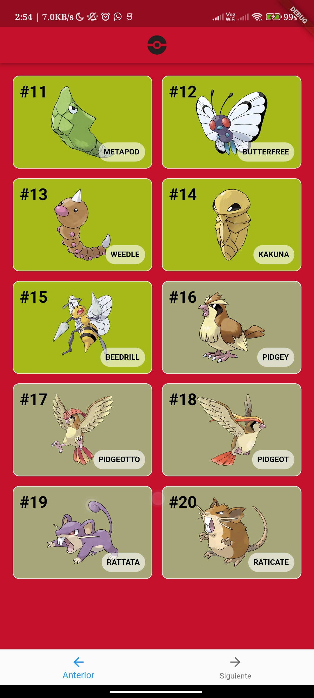
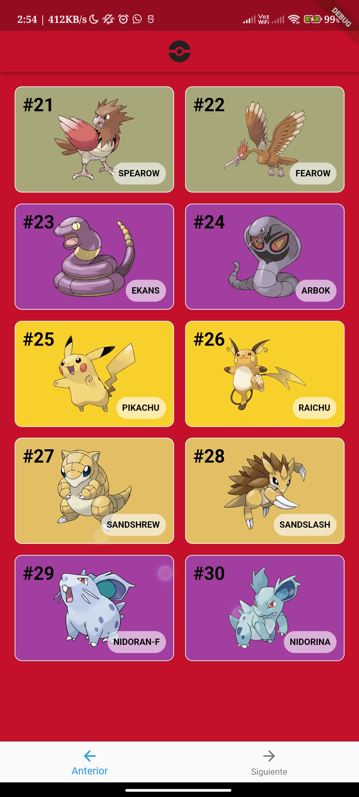
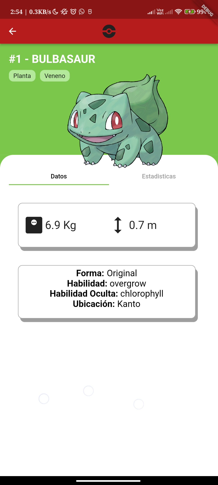

# Taller3-S22022-CPyD
Taller #3 para la asignatura Computación Paralela y Distribuida. Grupo 1.

Creación de una aplicación móvil, con _splash screen_, inicio de sesión, muestreo de pokemones, selección de ellos y actualización en BD.

## Profesor
* Andrés Águila Gaete

## Integrantes
* Martín Sobarzo Huerta
* Renato Palominos Concha
* Cristóbal Abarca Abarzúa
* Matías Álvarez Castillo
* Rodrigo Ubilla Castro

## Pantallas

# Muchas gracias.
